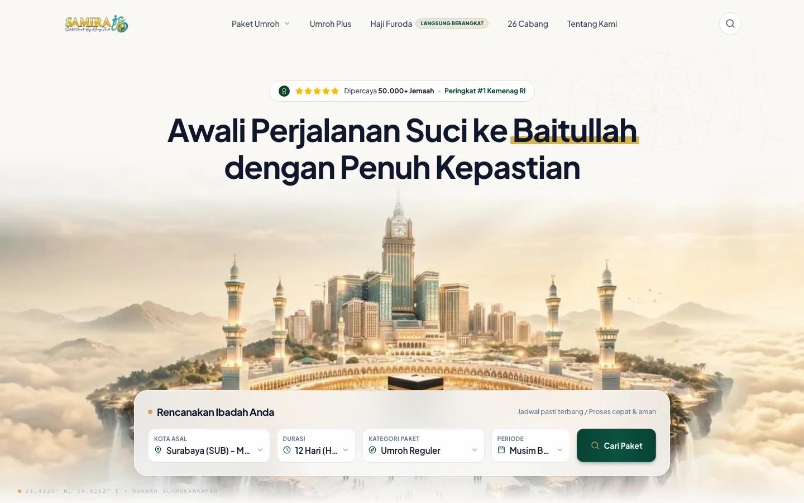
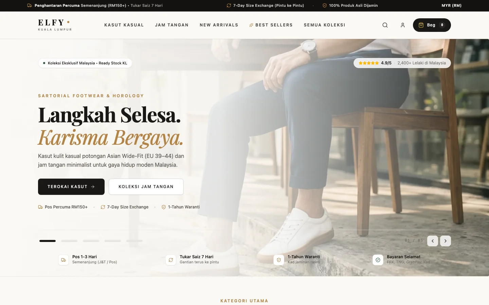
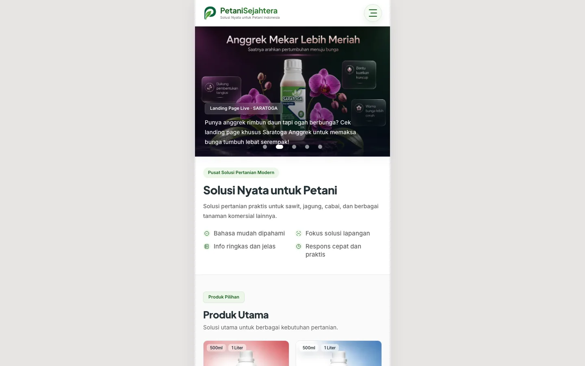
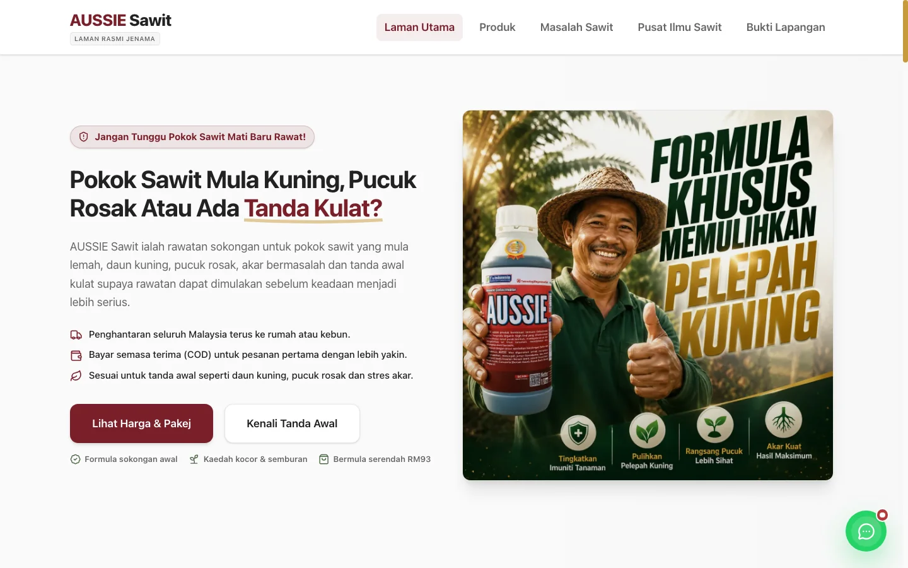
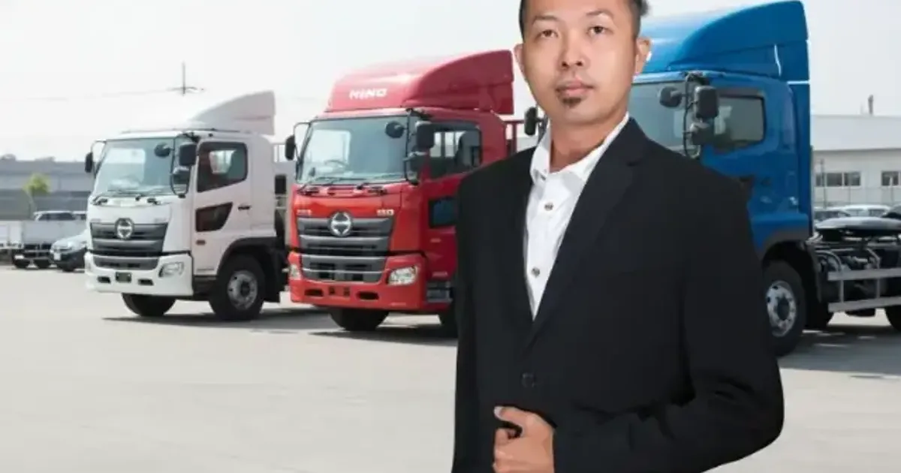

```text
   ██╗ █████╗ ███████╗ █████╗ ██╗    ██╗███████╗██████╗ 
   ██║██╔══██╗██╔════╝██╔══██╗██║    ██║██╔════╝██╔══██╗
   ██║███████║███████╗███████║██║ █╗ ██║█████╗  ██████╔╝   . C O
   ██║██╔══██║╚════██║██╔══██║██║███╗██║██╔══╝  ██╔══██╗
 ████║██║  ██║███████║██║  ██║╚███╔███╔╝███████╗██████╔╝
 ╚═══╝╚═╝  ╚═╝╚══════╝╚═╝  ╚═╝ ╚══╝╚══╝ ╚══════╝╚═════╝ 

                   B Y   O N G K I . P R O

     "Website & Sistem Digital untuk Bisnis yang Ingin Bertumbuh"

    [▶ PRESS START] jasawebsite.co  ·  [● SELECT] +62 838-3044-1495
```

<p align="center">
  <a href="https://jasawebsite.co"></a>
  <a href="https://jasawebsite.co"></a>
  <a href="https://jasawebsite.co"></a>
  <a href="https://jasawebsite.co"></a>
  <a href="https://wa.me/6283830441495"></a>
</p>

---

## 🕹️ 1. Studio Identity & Manifesto: JasaWebsite.co by ONG (`ongki.pro`)

**JasaWebsite.co by ONG** adalah *boutique software engineering studio* dan arsitek sistem digital yang dipimpin langsung oleh [**ongki.pro**](https://ongki.pro), berbasis di Surabaya, Indonesia. Kami merancang platform web komersial berstandar industri untuk korporasi, brand D2C mandiri, distributor skala nasional, eksportir, dan bisnis bertumbuh di Indonesia dan Asia Tenggara.

```text
┌────────────────────────────────────────────────────────────────────────────────────────┐
│                        STANDAR REKAYASA DIGITAL ONG-OS STUDIO                          │
├────────────────────────────────────────┬───────────────────────────────────────────────┤
│ ❌ AGENSI TEMPLATE BIASA (MARKETPLACE) │ ⚡ ONG-OS SOFTWARE STUDIO (JASAWEBSITE.CO)    │
├────────────────────────────────────────┼───────────────────────────────────────────────┤
│ • Template WordPress / Elementor berat │ • Pure Next.js 16 App Router SSG (Hardware)   │
│ • Loading lelet 3–8 detik (Pahit Iklan)│ • Sub-0.3s TTFB Global Edge CDN Delivery      │
│ • Rentan disusupi script malware & spam│ • Arsitektur statis kebal serangan CMS plugin │
│ • Server lambat & cPanel sering down   │ • Managed Enterprise Edge Cloud (99.9% Uptime)│
│ • Terkunci sepihak (Agency Lock-in)    │ • 100% Hak milik kode sumber via GitHub       │
│ • Pelacakan event iklan sering meleset │ • Integrasi Server-Side CAPI & dataLayer      │
└────────────────────────────────────────┴───────────────────────────────────────────────┘
```

### 🛡️ Filosofi Kemitraan: Mengapa Kami Tidak Menjual Web Lepas (The Managed Growth Moat)

Banyak pemilik bisnis kapok membeli website dari agensi template biasa: setelah serah terima, agensi menghilang, website dibiarkan usang, hosting cPanel sering *down*, pixel pelacak iklan mati saat ada update browser/iOS, dan tim sales mengeluhkan leads yang tidak pernah masuk. Akhirnya, website hanya berakhir jadi "kartu nama digital mati".

Di **JasaWebsite.co by ONG**, kami beroperasi sebagai **Boutique Software Studio & Growth Partner**. Kami merancang ekosistem yang **menjaga 4 urat nadi utama bisnis klien tetap beroperasi dan menghasilkan omzet**:

```text
┌────────────────────────────────────────────────────────────────────────────────────────┐
│                 ARSITEKTUR KEMITRAAN BERKELANJUTAN (BUKAN JUAL LEPAS)                  │
├──────────────────────────┬──────────────────────────┬──────────────────────────────────┤
│ [1] INFRASTRUKTUR CLOUD  │ [2] TRACKING IKLAN CAPI  │ [3] ALUR LEADS & OTOMASI SALES   │
├──────────────────────────┼──────────────────────────┼──────────────────────────────────┤
│ • Managed Edge CDN (sin1)│ • Server-Side Meta CAPI  │ • Form Web ➜ WhatsApp Sales     │
│ • Uptime 99.99% Terjamin │ • Event Match Quality >8 │ • Auto-Record Spreadsheet / CRM  │
│ • Zero Pusing cPanel/DNS │ • Anti Boncos Iklan Meta │ • Tim Sales Respon Hitungan Menit│
├──────────────────────────┴──────────────────────────┴──────────────────────────────────┤
│ [*] DEDICATED CARE RETAINER: Update Promo Bulanan, Audit Kecepatan & Siaga 24/7        │
└────────────────────────────────────────────────────────────────────────────────────────┘
```

1. **Urat Nadi Infrastruktur (Managed Global Edge Cloud):**  
   Website Anda beroperasi di jaringan edge berkecepatan tinggi (Singapore `sin1`) dengan uptime 99.99%, proteksi anti-DDoS, dan pemantauan 24/7. Anda tidak perlu membuang waktu mengurus cPanel, SSL error, atau server lambat.
2. **Urat Nadi Konversi Iklan (Server-Side Meta CAPI & Data Attribution):**  
   Kami memasang pelacakan *server-side* langsung dari edge cloud ke Meta Conversions API dan Google Tag Manager. Data konversi tidak akan hilang oleh ad-blocker atau kebijakan privasi browser, sehingga algoritma iklan Anda tetap tajam dan budget iklan ratusan juta tidak terbakar sia-sia.
3. **Urat Nadi Operasional Sales (Otomasi Leads ke WhatsApp & CRM):**  
   Website bukan sekadar tampilan visual, melainkan pintu masuk utama leads pembeli. Setiap formulir langsung terhubung ke WhatsApp tim sales secara instan dan tercatat otomatis di spreadsheet/CRM perusahaan.
4. **Urat Nadi Pertumbuhan & Retainer (Dukungan Rekayasa Berkelanjutan):**  
   Setiap bulan bisnis pasti membutuhkan halaman promo baru, pembaruan katalog produk, atau kampanye musiman (Ramadhan, Gajian, Harbolnas). Retainer bulanan kami memberikan jatah pengerjaan (*sprint quota*) dan tim senior siaga dengan biaya jauh lebih terjangkau dibandingkan merekrut tim programmer dan desainer in-house tetap (hemat Rp 10–15jt/bulan).

---

## ⚡ 2. Lima Pilar Solusi Rekayasa Digital

Kami membagi keahlian studio ke dalam 5 pilar layanan utama yang siap dieksekusi secara cepat (*agile sprint*):

### 🏢 [01] Company Profile Website Korporat & B2B
[](https://jasawebsite.co/folio/company-profile)
[](https://jasawebsite.co/folio/company-profile)
[](https://jasawebsite.co/folio/company-profile)
[](https://jasawebsite.co/folio/company-profile)

> **Membangun Kredibilitas Resmi, Lolos Kurasi Vendor & Pemenang Tender Besar**  
> *Target: PT, CV, Pabrik Manufaktur, Kontraktor, Kantor Hukum, Konsultan, Holding Company.*

- **Fitur Rekayasa:** Tata letak hierarki reputasi standar ISO/Tender, portofolio proyek terverifikasi, profil legalitas terstruktur, formulir RFP resmi terintegrasi domain (`nama@perusahaan.co.id`), serta Schema.org `ProfessionalService`.
- **Anchor Investasi:** Mulai `Rp 2,9jt` (Starter) · `Rp 4,9jt` (Vendor B2B ⭐) · `Rp 8,9jt–Rp 15jt+` (Standar Tender Besar).
- **Detail Lengkap:** [jasawebsite.co/folio/company-profile](https://jasawebsite.co/folio/company-profile)

---

### 🎯 [02] Sales & Lead Generation Website (Ads to WhatsApp)
[](https://jasawebsite.co/folio/sales-website)
[](https://jasawebsite.co/folio/sales-website)
[](https://jasawebsite.co/folio/sales-website)
[](https://jasawebsite.co/folio/sales-website)

> **Corong Konversi Traffic Iklan Berbayar Menjadi Leads Pembeli Bernilai Tinggi**  
> *Target: Dealer Mobil/Truk, Agen Properti & Real Estate, Distributor Mesin/Alat Berat, Tim Sales Iklan.*

- **Fitur Rekayasa:** Corong 4-tahap (*Traffic ➜ Proof ➜ Offer ➜ Closing*), kalkulator simulasi kredit / DP interaktif tanpa reload, filter katalog spesifikasi produk sub-detik, smart WhatsApp handoff router per cabang, dan pelacakan Server-Side CAPI (Meta & Google Ads).
- **Anchor Investasi:** Mulai `Rp 3,5jt` (Landing Page Siap Jualan) · `Rp 6,5jt` (Mesin Iklan Siap Tempur ⭐) · `Rp 12,5jt+` (Showroom Digital Interaktif).
- **Detail Lengkap:** [jasawebsite.co/folio/sales-website](https://jasawebsite.co/folio/sales-website)

---

### 🛒 [03] Toko Online Mandiri D2C (Bebas Komisi Marketplace)
[](https://jasawebsite.co/folio/ecommerce-shopify)
[](https://jasawebsite.co/folio/ecommerce-shopify)
[](https://jasawebsite.co/folio/ecommerce-shopify)
[](https://jasawebsite.co/folio/ecommerce-shopify)

> **Platform E-Commerce 100% Hak Milik Pribadi — 0% Potongan Admin Selamanya**  
> *Target: Brand Retail, Produsen Fashion & Apparel, Skincare & Kosmetik, UKM Produk Fisik.*

- **Fitur Rekayasa:** Pengalaman checkout kilat di smartphone, kalkulator ongkir kurir otomatis se-Indonesia (JNE, SiCepat, J&T), integrasi payment gateway QRIS & Virtual Account instan, serta notifikasi pesanan otomatis via WhatsApp admin.
- **Anchor Investasi:** Mulai `Rp 3,9jt` (Toko Mandiri CMS Studio) · `Rp 8,9jt–Rp 19,9jt+` (Toko Skala Besar & Reseller).
- **Detail Lengkap:** [jasawebsite.co/folio/ecommerce-shopify](https://jasawebsite.co/folio/ecommerce-shopify)

---

### 🛍️ [04] Shopify Custom Storefront & Headless Commerce
[](https://jasawebsite.co/folio/ecommerce-shopify)
[](https://jasawebsite.co/folio/ecommerce-shopify)
[](https://jasawebsite.co/folio/ecommerce-shopify)
[](https://jasawebsite.co/folio/ecommerce-shopify)

> **Pengembangan Toko Shopify Kelas Dunia dengan Desain Eksklusif & Konversi Tinggi**  
> *Target: Brand D2C Nasional & Internasional yang Menginginkan Storefront Mewah Tanpa Batasan Tema Standar.*

- **Fitur Rekayasa:** Arsitektur Shopify Online Store 2.0 (Liquid) atau Headless Hydrogen (Oxygen CDN), integrasi payment gateway lokal (QRIS, VA, FPX Malaysia), optimasi mobile cart drawer, dan pelacakan event e-commerce presisi tinggi.
- **Anchor Investasi:** Mulai `Rp 6,9jt` (Shopify Custom Storefront ⭐) · Custom Quote untuk Headless Hydrogen.
- **Detail Lengkap:** [jasawebsite.co/folio/ecommerce-shopify](https://jasawebsite.co/folio/ecommerce-shopify)

---

### ⚙️ [05] Custom Web Application & Business Operating Systems
[](https://jasawebsite.co/folio/custom-web-app)
[](https://jasawebsite.co/folio/custom-web-app)
[](https://jasawebsite.co/folio/custom-web-app)
[](https://jasawebsite.co/folio/custom-web-app)

> **Digitalisasi Alur Kerja Kunci Perusahaan: CRM, Mini ERP, Customer Portal & Dashboard**  
> *Target: Bisnis Berkembang yang Ingin Menggantikan File Spreadsheet Manual Menjadi Sistem Otomatis.*

- **Fitur Rekayasa:** Pipeline prospek sales lapangan (CRM), pelacakan stok inventaris multi-gudang, pembuatan surat jalan & invoice ber-QR code otomatis, role-based access control (RBAC), arsitektur database performa tinggi (PostgreSQL / Edge Database).
- **Anchor Investasi:** Mulai `Rp 15jt–Rp 25jt` (Digitalisasi 1 Alur MVP) · `Rp 25jt–Rp 50jt` (Sistem Terpadu ⭐) · `Rp 50jt–Rp 100jt+` (Platform SaaS).
- **Detail Lengkap:** [jasawebsite.co/folio/custom-web-app](https://jasawebsite.co/folio/custom-web-app)

---

### 🛡️ [Supporting] Website Maintenance Care & Strategic Ads Retainer
[](https://jasawebsite.co/folio/maintenance-care)
[](https://jasawebsite.co/folio/maintenance-care)
[](https://jasawebsite.co/folio/maintenance-care)
[](https://jasawebsite.co/folio/maintenance-care)

> **Proteksi Performa 24/7, Monitoring Uptime, Setup Iklan & Strategic Engineering Partner**  
> *Retainer Bulanan: Rp 2,5jt/bln (Growth Care) · Rp 4,5jt–Rp 7,5jt/bln (Scale & Ads ⭐) · Rp 10jt–Rp 25jt+/bln (Dedicated Partner).*

- **Detail Lengkap:** [jasawebsite.co/folio/maintenance-care](https://jasawebsite.co/folio/maintenance-care)

---

## 📸 3. Galeri Portofolio: 13 Proyek Terverifikasi Live

Berikut adalah bukti nyata hasil karya studio yang sedang beroperasi di server produksi live:

<table>
  <tr>
    <td width="50%" align="center">
      <a href="https://samiratravelumrohhaji.com">
        
      </a><br/>
      <b>Samira Travel Umroh & Haji Khusus</b><br/>
      <sub>Next.js SSG · Biro Umroh #1 Kemenag RI (50rb+ Jemaah) · <a href="https://samiratravelumrohhaji.com">Kunjungi Situs ↗</a></sub>
    </td>
    <td width="50%" align="center">
      <a href="https://elfy.my">
        
      </a><br/>
      <b>ELFY Malaysia (Kuala Lumpur)</b><br/>
      <sub>Shopify Hydrogen · Brand Fesyen Pria D2C · <a href="https://elfy.my">Kunjungi Situs ↗</a></sub>
    </td>
  </tr>
  <tr>
    <td width="50%" align="center">
      <a href="https://petanisejahtera.com">
        
      </a><br/>
      <b>Petani Sejahtera Indonesia</b><br/>
      <sub>Astro SSG · Solusi Tani Super Ringan (0.26s TTFB) · <a href="https://petanisejahtera.com">Kunjungi Situs ↗</a></sub>
    </td>
    <td width="50%" align="center">
      <a href="https://aussiesawit.my">
        
      </a><br/>
      <b>AUSSIE Sawit Malaysia</b><br/>
      <sub>Astro SSG · Rawatan Sawit Cash-on-Delivery (COD) · <a href="https://aussiesawit.my">Kunjungi Situs ↗</a></sub>
    </td>
  </tr>
  <tr>
    <td width="50%" align="center">
      <a href="https://beautyinu.co">
        
      </a><br/>
      <b>Beautyinu Skincare</b><br/>
      <sub>Shopify D2C Storefront · Bebas Fee Komisi + QRIS · <a href="https://beautyinu.co">Kunjungi Situs ↗</a></sub>
    </td>
    <td width="50%" align="center">
      <a href="https://dealerhinoofficial.com">
        
      </a><br/>
      <b>Dealer Truk Hino Resmi Indonesia</b><br/>
      <sub>Next.js Sales LP · Simulasi Angsuran & Handoff WA · <a href="https://dealerhinoofficial.com">Kunjungi Situs ↗</a></sub>
    </td>
  </tr>
</table>

### Direktori Lengkap 13 Klien Live:
| No | Klien / Proyek | Solusi Rekayasa | Arsitektur Teknis | Tautan Produksi |
|:---|:---|:---|:---|:---|
| **01** | **Samira Travel Umroh** | Corporate & Branch Network | Next.js SSG + Edge CDN | [samiratravelumrohhaji.com](https://samiratravelumrohhaji.com) |
| **02** | **ELFY Malaysia** | Shopify Headless Storefront | Hydrogen + Oxygen CDN | [elfy.my](https://elfy.my) |
| **03** | **Batik Smile Semarang** | E-Commerce Retail Store | Shopify 2.0 + WA Concierge | [batiksmile.com](https://batiksmile.com) |
| **04** | **Beautyinu Skincare** | D2C Brand Storefront | Shopify D2C + QRIS Gateway | [beautyinu.co](https://beautyinu.co) |
| **05** | **Petani Sejahtera** | Agro E-Commerce & Solution | Astro SSG + Tailwind + CAPI | [petanisejahtera.com](https://petanisejahtera.com) |
| **06** | **AUSSIE Sawit Malaysia** | D2C Cross-Border Commerce | Astro SSG + COD Logistics | [aussiesawit.my](https://aussiesawit.my) |
| **07** | **Dealer Truk Hino Resmi** | Sales & Lead Generation LP | Next.js + Meta CAPI + Kredit | [dealerhinoofficial.com](https://dealerhinoofficial.com) |
| **08** | **Dealer Truk Hino Jatim** | Heavy Vehicle Tech Catalog | Next.js SSG + 46 Varian Truk | [dealertrukhino.com](https://dealertrukhino.com) |
| **09** | **Dealer Foton Indonesia** | Commercial Showroom | Next.js + Filter Spek Instan | [dealerfoton.com](https://dealerfoton.com) |
| **10** | **Traktor Nusa Teknik** | Industrial RFQ Portal | Next.js + Form RFQ Korporat | *Internal B2B System* |
| **11** | **Logis-Track Armada** | Custom Web Application | Next.js + PostgreSQL + QR Code | *Internal System* |
| **12** | **Petcue Travel Gear** | International E-Commerce | Next.js + Global Edge Cloud | [petcue.co](https://petcue.co) |
| **13** | **Homelook Architectural** | Luxury Architectural D2C | Next.js + Edge CDN | [homelook.shop](https://homelook.shop) |

---

## 🌐 4. Blueprint Solusi untuk 24 Sektor Industri di Indonesia

Kami memiliki spesifikasi rekayasa teruji untuk 24 sektor industri di Indonesia:

```text
┌───────────────────────────────────┬───────────────────────────────────┐
│ SEKTOR INDUSTRI KOMERSIAL         │ KATEGORI BISNIS                   │
├───────────────────────────────────┼───────────────────────────────────┤
│ [01] Dealer Mobil Baru & Bekas    │ Otomotif & Transportasi           │
│ [02] Rental Mobil & Bus Wisata    │ Otomotif & Transportasi           │
│ [03] Bengkel Mobil & Body Repair  │ Otomotif & Transportasi           │
│ [04] Distributor Alat Berat/Mesin │ Industri & Manufaktur             │
│ [05] Pabrikasi Manufaktur B2B     │ Industri & Manufaktur             │
│ [06] Percetakan Kemasan Packaging │ Industri & Manufaktur             │
│ [07] Developer Real Estate        │ Properti & Konstruksi             │
│ [08] Kontraktor Bangunan/Arsitek  │ Properti & Konstruksi             │
│ [09] Klinik Medis & Rumah Sakit   │ Kesehatan & Medis                 │
│ [10] Distributor Alkes & Farmasi  │ Kesehatan & Medis                 │
│ [11] Kantor Hukum & Advokat       │ Jasa Profesional & Legal          │
│ [12] Konsultan Pajak & Akuntan    │ Jasa Profesional & Legal          │
│ [13] Integrator IT Solution/CCTV  │ Jasa Profesional & Legal          │
│ [14] Brand Fashion & Apparel      │ Retail & Gaya Hidup D2C           │
│ [15] Brand Skincare BPOM          │ Retail & Gaya Hidup D2C           │
│ [16] Restoran, Cafe & Kuliner F&B │ Retail & Gaya Hidup D2C           │
│ [17] Wedding Planner & EO         │ Retail & Gaya Hidup D2C           │
│ [18] Ekspedisi & Logistik Cargo   │ Logistik & Transportasi           │
│ [19] Eksportir Komoditas Alam     │ Ekspor & Komoditas                │
│ [20] Sekolah, Kampus & Bimbel     │ Pendidikan & Pelatihan            │
│ [21] Biro Travel Umroh & Haji     │ Wisata Halal & Religi             │
│ [22] Cleaning Service Komersial   │ Jasa Komersial B2B                │
│ [23] Agribisnis & Peternakan      │ Agribisnis Modern                 │
│ [24] Koperasi & Keuangan Mikro    │ Finansial & Lembaga Kredit        │
└───────────────────────────────────┴───────────────────────────────────┘
```

*Pelajari lembar kerja 24 industri selengkapnya di:* [https://jasawebsite.co/folio/colophon](https://jasawebsite.co/folio/colophon)

---

## 🤝 5. Cara Memulai Kerjasama: The Engagement Sprint

```text
 ┌──────────────────────┐     ┌──────────────────────┐     ┌──────────────────────┐
 │  01. EVALUASI WA/CALL│ ──> │  02. PROPOSAL SOW    │ ──> │  03. SPRINT REKAYASA │
 │  Model Bisnis & Goal │     │  Spesifikasi & Biaya │     │  Arsitektur Next.js  │
 └──────────────────────┘     └──────────────────────┘     └──────────────────────┘
                                                                       │
                                                                       ▼
 ┌──────────────────────┐     ┌──────────────────────┐     ┌──────────────────────┐
 │  KEMITRAAN PANJANG   │ <── │  05. MANAGED CARE    │ <── │  04. GO-LIVE & DATA  │
 │  Ekosistem Terawat   │     │  Retainer & Scaling  │     │  Edge Cloud & CAPI   │
 └──────────────────────┘     └──────────────────────┘     └──────────────────────┘
```

1. **Evaluasi Kebutuhan Awal:** Diskusi langsung via WhatsApp/Call. Kami telaah model bisnis, target audiens, dan problem operasional/iklan yang ingin diselesaikan.
2. **Draft SOW & Estimasi Anggaran (24–48 Jam):** Kami susun dokumen Scope of Work terperinci dengan timeline sprint yang jelas, rincian deliverables, serta garansi biaya pasti (tanpa biaya tersembunyi).
3. **Fase Sprint Rekayasa (Engineering Sprint):** Pengerjaan kode murni dengan arsitektur Next.js 16 SSG. Calon klien bisa memantau progres secara berkala via link staging privat.
4. **Go-Live, Domain DNS & Setup Tracking Server-Side:** Peluncuran ke jaringan managed edge cloud berkecepatan tinggi, setup integrasi CAPI Meta/Google Ads, routing formulir ke WhatsApp sales, dan penyerahan 100% kepemilikan repositori Git.
5. **Managed Care & Kemitraan Pertumbuhan Berkelanjutan:** Pendampingan aktif pasca-rilis: monitoring uptime 24/7, pemeliharaan sinyal iklan, audit kecepatan, serta kuota update landing page dan materi promo bulanan.

### Hubungi Kami Langsung:
- 💬 **WhatsApp Resmi:** [+62 838-3044-1495](https://wa.me/6283830441495?text=Halo%20Tim%20JasaWebsite.co%20by%20ONG%2C%20saya%20tertarik%20konsultasi%20pembuatan%20website%20%2F%20sistem%20digital%20untuk%20bisnis%20saya.)
- 🌐 **Portal Platform:** [https://jasawebsite.co](https://jasawebsite.co)
- ✉️ **Email Kerja:** [get@ongki.pro](mailto:get@ongki.pro)
- 📍 **Lokasi Studio:** Surabaya, Jawa Timur, Indonesia

---

## 🛠️ 6. Tentang Repositori Ini (`ongkipro/jasawebsite`)

Platform ini bukan sekadar website agensi biasa, melainkan **etalase hidup (*living demonstration*)** atas filosofi rekayasa kami: **The Living Digital Brochure (Buku Lembar-per-Lembar)**.

### Keunggulan Teknis Living Digital Brochure
- **Pengalaman Buku Fisik yang Taktil:** Menghadirkan kembali nuansa membuka portofolio fisik (*two-page spread* di desktop dengan bayangan lipatan buku/spine crease, dan *single-sheet swipe* di smartphone dengan gestur jempol `drag="x"`).
- **100% Crawlable & SEO-Friendly (Anti-Canvas Slop):** Setiap lembar adalah komponen semantic HTML5 (`<article>`, `<h1>`-`<h6>`, `<p>`) yang di-prerender saat build time dengan route canonical mandiri (`/folio/[slug]`).
- **Dynamic Client-Side SEO Sync:** Perpindahan lembar secara interaktif langsung memperbarui `document.title`, `<meta name="description">`, `<link rel="canonical">`, OpenGraph, Twitter card, dan Schema.org JSON-LD via `syncDocumentSeo(slug)`.
- **Tear-Off Perforated Voucher:** Tombol CTA berwujud kupon sobek fisik dengan garis jahitan putus-putus dan stempel tinta basah studio ([`InkStamp.tsx`](src/components/ui/InkStamp.tsx)).
- **Warm Swiss Monograph Aesthetic:** Menolak template card AI yang monoton. Mengadopsi tipografi monograf Swiss dengan palet kertas hangat (`#fbfbfa`), tinta karbon (`#111111`), pembatas hairline tipis, dan stabilo highlighter.

### Spesifikasi Arsitektur & Tech Stack
- **Framework:** Next.js 16.3.4 (App Router, Turbopack, SSG `output: 'export'`)
- **Styling:** Tailwind CSS v4 (Desain token monograf Swiss, zero runtime CSS)
- **Animasi:** Motion 13.2.0 (Framer Motion akselerasi GPU 60–120 FPS, fallback `prefers-reduced-motion`)
- **Ikon:** Lucide React (100% SVG vektor pohon, zero emoji)
- **Bahasa:** Strict TypeScript (Target ES2022)
- **Structured Data:** Master Schema.org JSON-LD (`ProfessionalService`, `FAQPage`, `ItemList`, `BreadcrumbList`)
- **Infrastruktur Target:** Managed Global Edge Network (Singapore `sin1`) — Sub-0.3s TTFB latency, auto-scaling, dan enterprise security.

### Struktur Direktori Repositori
```text
jasawebsite/
├── docs/
│   ├── spec/           # Canonical Specs (BRD, PRD, Arsitektur, pSEO)
│   └── audit/          # Riset & Analisis Komparasi Agensi Web
├── src/
│   ├── app/            # Next.js 16 App Router (Layout, Folio, Sitemap)
│   ├── components/
│   │   ├── book/       # Engine Buku Taktil (BookShell, TearOffVoucher)
│   │   ├── sheets/     # Lembaran Semantik HTML (Cover, Compro, Sales)
│   │   └── ui/         # Komponen Atomik (Button, Badge, InkStamp)
│   ├── data/           # Static JSON Data (services, portfolio, niches)
│   ├── types/          # TypeScript Strict Interfaces
│   └── lib/            # Utilities (whatsapp.ts, seo.ts, cn.ts)
├── scripts/
│   └── verify-build.js # Smoke Test Suite (72 automated assertions)
├── ARCHITECTURE.md     # System Boundaries & Engineering Guardrails
├── TASKS.md            # Executable Work Queue
├── STATUS.md           # State Machine & Log Pengiriman
├── BUILD-LOG.md        # Catatan Teknis Berkelanjutan (Phases 1–26)
├── RELEASE.md          # Manifes Rilis Produksi & Bukti Deploy Edge
└── PETA-DEVELOPMENT.md # Katalog Spesifikasi 33 Rute Publik
```

### Panduan Menjalankan Repositori Secara Lokal

Prasyarat: Node.js 20.x atau lebih baru, dan npm.

```bash
# 1. Clone repositori ke mesin lokal
git clone https://github.com/ongkipro/jasawebsite.git
cd jasawebsite

# 2. Pasang seluruh dependensi
npm install

# 3. Jalankan development server lokal
npm run dev
# Buka http://localhost:3000 pada peramban Anda

# 4. Kompilasi build statis (Static Site Generation / SSG)
npm run build
# Seluruh output statis dikompilasi ke direktori /out (41 halaman HTML/XML)

# 5. Jalankan automated smoke verification suite
npm test
# Menjalankan 72 checks deterministik: JSON-LD, routes, SEO titles, no-pipe, no-slop

# 6. Audit kualitas dan linting kode
npm run lint
```

---

## 📜 7. Hak Cipta & Lisensi

Hak Cipta © 2026 **JasaWebsite.co by ONG** ([ongki.pro](https://ongki.pro)). Seluruh hak cipta dilindungi undang-undang.

Seluruh materi editorial, struktur penawaran komersial, identitas merek, naskah copywriting, dan studi kasus portofolio yang ada di dalam repositori ini adalah milik sah dari [**ongki.pro**](https://ongki.pro). Pola arsitektur teknis dan komponen rekayasa disajikan sebagai bukti transparansi teknis dan komitmen kualitas studio kepada calon klien dan mitra bisnis.
